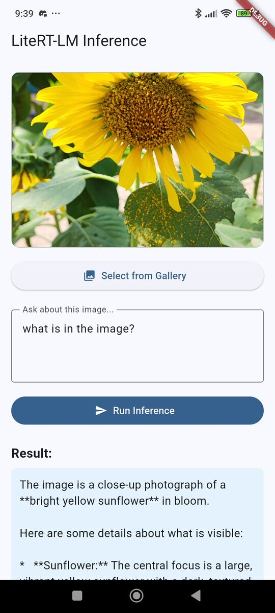

# Flutter LiteRT-LM Edge AI

A Flutter application demonstrating on-device multimodal AI inference using Google's **LiteRT-LM** via a custom **JNI** bridge using `jnigen`. This project allows users to select images from their gallery and perform visual question-answering (VQA) directly on the device.

Tested with the `gemma-4-E2B-it.litertlm` model from Hugging Face, which supports both vision and language tasks.

## 📷 Screenshot


## 🚀 Overview

This repository showcases a hybrid architecture for high-performance Edge AI:
- **Kotlin/Java Layer**: Manages the LiteRT-LM C++ engine and handles native Android memory/vision backends.
- **Dart/Flutter Layer**: Provides a modern UI for user interaction and image processing.
- **JNI (Java Native Interface)**: Facilitates low-latency communication between the Dart VM and the Android JVM using `jnigen`.

## 🛠️ Features

* **On-Device Inference**: No cloud dependencies; all processing stays on the hardware.
* **Multimodal Capabilities**: Processes both text prompts and image files simultaneously.
* **Hardware Acceleration**: Configured to use GPU for vision processing and CPU for language modeling.
* **Variable Resolution Control**: Empowers users to balance inference speed and spatial accuracy by selecting specific Gemma 4 Token Budgets (70 to 1120 tokens).
* **Optimized Image Handling**: Uses `image_picker` coupled with token budget calculations for native-side resizing and quality control *before* inference.
* **Clean Architecture**: Segregated `InferenceService` layer for easy maintenance and testing.

## 📁 Repository Structure

```text
android/                # Native Android configuration
  └── app/src/main/kotlin/.../
      ├── LitertBridge.kt # Native LiteRT-LM engine wrapper
      └── MainActivity.kt # Flutter entry point
lib/
  ├── src/generated/    # Auto-generated JNI bindings (via jnigen)
  ├── main.dart         # App entry and initialization
  ├── inference_service.dart # Bridge between Flutter and Native
  └── multi_modal_inference_screen.dart # Main UI
tool/
  └── jnigen.dart       # JNI binding generation script
pubspec.yaml            # Project dependencies
```

## ⚙️ Prerequisites
* **Flutter SDK:** ^3.11.4
* **Android Device:** A physical device with a modern SoC (NPU/GPU support recommended).
* **ADB:** Required for pushing the model file to the device.
* **LiteRT-LM Model:** A `.litertlm` compatible model file.
    - for example, [gemma-4-E2B-it-litert-lm](https://huggingface.co/litert-community/gemma-4-E2B-it-litert-lm/tree/main). select `gemma-4-E2B-it.litertlm` and download it.

## ⛓️ Dependencies
Ensure your `pubspec.yaml` includes the bleeding-edge `jnigen` fix for Kotlin metadata parsing:
```yaml
dev_dependencies:
  jnigen:
    git:
      url: https://github.com/dart-lang/native.git
      ref: main 
      path: pkgs/jnigen
```
*(Requires Apache Maven installed on your machine for the initial build: `sudo apt-get install maven`)*

## 🚦 Getting Started

**1. Build the App**
* **Set the Global JDK for Flutter:**

  `litertlm-android` enforces Java 21. Make sure it is installed and set as the global JDK for Flutter:
  ```bash
  flutter config --jdk-dir="/usr/lib/jvm/java-21-openjdk-amd64"
  ```
* **Clean the Build Cache:**
  ```bash
  flutter daemon --kill
  flutter clean
  flutter pub get
  ```  
* **Build the APK:**
  ```bash
  flutter build apk
  ```
**2. Generate JNI Bindings**

If you modify the Kotlin `LitertBridge.kt` file, regenerate the Dart bindings:
```bash
dart run tool/jnigen.dart
```
**3. Run the App**
```bash
flutter run
```
*Note: The app will likely show the "Startup Error" because it won't find the model file.*

**4. Model Setup**
Push your LiteRT-LM model to the application's external storage directory:
```bash
adb push <your_model.litertlm> /storage/emulated/0/Android/data/com.example.flutter_litert_lm_app/files/model.litertlm
```
*Note: This is needed because the model file size exceeds typical APK limits, and we want to avoid bundling it directly.*

*You can replace the ADB step with a download screen that uses the `dio` or `http` package to stream the `.litertlm` file directly from a server into the `getExternalStorageDirectory()` path*

## 🧠 Technical Details

### Hardware Configuration
The `LitertBridge` is configured to optimize performance across different processing units:
* **Vision:** GPU (`Backend.GPU()`)
* **Language:** CPU (`Backend.CPU()`)
* **Audio:** CPU (`Backend.CPU()`)

***TODO:** Add steps to enable NPU support if available on the device.*

### Token Budgets & Image Resizing
To prevent the LiteRT engine from wasting cycles downscaling images in memory, the app calculates the optimal input resolution based on Gemma 4's expected Token Budgets.

Using the formula `Dimension ≈ √(Token Budget × 9 × 14²)`, the image_picker native layer directly scales the image to the exact pixel footprint the model needs:

* **70 Tokens:** ~350x350px (Fastest)

* **280 Tokens:** ~700x700px (Balanced)

* **1120 Tokens:** ~1400x1400px (Slowest, suitable for OCR/detail)

### Memory Management
The app utilizes `package:jni` for efficient memory handling. Native strings (`JString`) and objects are manually released in the `InferenceService` within `finally` blocks to prevent memory leaks across the bridge.

## 📄  License
This project is licensed under the MIT License - see the [LICENSE](LICENSE) file for details.

## 🙏Acknowledgments
* [Google LiteRT-LM](https://ai.google.dev/edge/litert-lm/overview)
* Hugging Face: [litert-community/gemma-4-E2B-it-litert-lm](https://huggingface.co/litert-community/gemma-4-E2B-it-litert-lm)
* [jnigen](https://pub.dev/packages/jnigen)